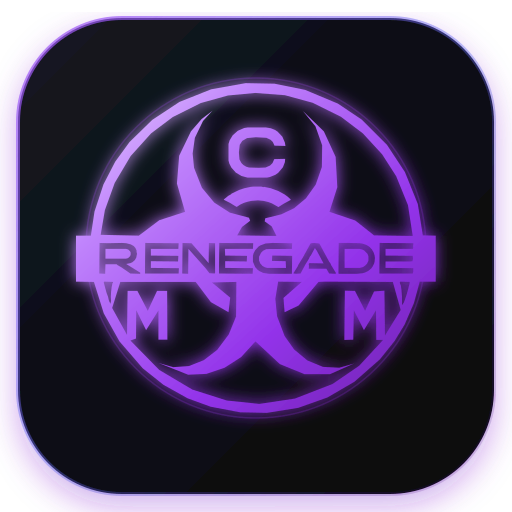

# Renegade Core Model Manager (CMM)

<!-- markdownlint-disable MD033 -->
<p align="center">
  
</p>
<!-- markdownlint-enable MD033 -->

**The missing model manager for ComfyUI.** A unified desktop application for discovering, downloading, organizing, and version-managing generative AI models across **CivitAI and Hugging Face Hub**, with zero-memory binary GGUF header parsing and intelligent auto-sorting into ComfyUI's folder structure.


[](PRIVACY.md)
[](FEATURES.md)
[](ROADMAP.md)

> ⚡ **Want the quick summary without the long read? Check out the [Feature Crib-Notes (FEATURES.md)](FEATURES.md).**  
> 🗺️ **Looking for upcoming features and releases? Check out the [Product Roadmap](ROADMAP.md).**  
> 🛡️ **Questions about data security or credentials? Read our [Privacy Policy (PRIVACY.md)](PRIVACY.md).**

---

## 📑 Table of Contents

- [Renegade Core Model Manager (CMM)](#renegade-core-model-manager-cmm)
  - [📑 Table of Contents](#-table-of-contents)
  - [📸 Screenshots](#-screenshots)
  - [🎯 Why CMM?](#-why-cmm)
  - [✨ Features](#-features)
    - [🔍 Discovery \& Search](#-discovery--search)
    - [📥 Download Management \& Version Updating](#-download-management--version-updating)
    - [📁 Library Management \& Persistent Scanner](#-library-management--persistent-scanner)
    - [⚙ System Backup \& Diagnostics](#-system-backup--diagnostics)
    - [🔧 ComfyUI Integration \& Companion Custom Node](#-comfyui-integration--companion-custom-node)
    - [🎨 Live ComfyUI Workspace \& Workflow Resolver](#-live-comfyui-workspace--workflow-resolver)
  - [📦 Installation](#-installation)
    - [Windows](#windows)
    - [Linux](#linux)
    - [macOS (Community \& Self-Build)](#macos-community--self-build)
    - [Build \& Run from Source](#build--run-from-source)
      - [🚀 Recommended: Launch with `cmm.ps1` (Windows), `cmm.sh` (Linux), or `cmm-mac.sh` (macOS)](#-recommended-launch-with-cmmps1-windows-cmmsh-linux-or-cmm-macsh-macos)
      - [🍏 Building \& Packaging on macOS](#-building--packaging-on-macos)
      - [⚠ macOS Platform Caveats \& Limitations](#-macos-platform-caveats--limitations)
      - [Packaging Standalone Binaries \& Cross-Platform Releases](#packaging-standalone-binaries--cross-platform-releases)
      - [Script Parameters \& Flags Reference](#script-parameters--flags-reference)
  - [🚀 Quick Start](#-quick-start)
    - [1. First Launch Setup](#1-first-launch-setup)
    - [2. Scan Existing Library \& Resolve Duplicates](#2-scan-existing-library--resolve-duplicates)
    - [3. Search and Download](#3-search-and-download)
  - [⚙ Configuration](#-configuration)
    - [Folder Mappings](#folder-mappings)
    - [API Sources](#api-sources)
  - [📂 Supported Folder Structure](#-supported-folder-structure)
    - [Core Model Folders](#core-model-folders)
    - [Specialized Folders](#specialized-folders)
    - [Utility Folders](#utility-folders)
  - [🎮 Usage Guide](#-usage-guide)
    - [Searching \& Browsing Models](#searching--browsing-models)
    - [Downloading \& Safe Version Updating](#downloading--safe-version-updating)
    - [Managing \& Deleting Library Models](#managing--deleting-library-models)
    - [👥 Duplicate Resolution \& Ignored Duplicate Sets](#-duplicate-resolution--ignored-duplicate-sets)
    - [🔄 Persistent Background Scanning](#-persistent-background-scanning)
    - [📦 Complete System Backup \& Restore (.ZIP)](#-complete-system-backup--restore-zip)
    - [📊 About \& Diagnostics Reporting](#-about--diagnostics-reporting)
  - [🔐 API Key Setup](#-api-key-setup)
    - [Getting Your CivitAI API Key](#getting-your-civitai-api-key)
    - [Adding to CMM](#adding-to-cmm)
  - [🛠 Troubleshooting](#-troubleshooting)
    - [Downloads Failing](#downloads-failing)
    - [Models Not Auto-Sorting](#models-not-auto-sorting)
    - [Hash Mismatch After Download](#hash-mismatch-after-download)
    - [Scan Taking Forever](#scan-taking-forever)
    - ["Model Not Found on CivitAI"](#model-not-found-on-civitai)
  - [🧪 Advanced Features](#-advanced-features)
    - [Command Line Interface](#command-line-interface)
    - [Webhook Integration](#webhook-integration)
    - [Backup and Restore](#backup-and-restore)
  - [🤝 Contributing](#-contributing)
    - [Development Setup](#development-setup)
  - [📜 License](#-license)
    - [License Summary](#license-summary)
  - [☕ Buy me a coffee or something please?](#-buy-me-a-coffee-or-something-please)
  - [🔐 Code Signing](#-code-signing)
  - [🙏 Author \& Acknowledgments](#-author--acknowledgments)
  - [📧 Support \& Feedback](#-support--feedback)

---

## 📸 Screenshots

<!-- markdownlint-disable MD033 -->
<p align="center">
  <sub><i>Click any screenshot to expand and view full resolution.</i></sub>
</p>

|                                                  **Discover & Browse Catalog**                                                   |                                               **Local Model Library & Deduplication**                                               |
| :------------------------------------------------------------------------------------------------------------------------------: | :---------------------------------------------------------------------------------------------------------------------------------: |
| <a href="docs/screenshots/browse-tab.png"></a> | <a href="docs/screenshots/library-tab.png"></a> |

|                                                **Concurrent Downloads & Auto-Sorting**                                                |                                                 **Multi-Folder Settings & Backup**                                                  |
| :-----------------------------------------------------------------------------------------------------------------------------------: | :---------------------------------------------------------------------------------------------------------------------------------: |
| <a href="docs/screenshots/downloads-tab.png"></a> | <a href="docs/screenshots/settings-tab.png"></a> |

|                                                         **Workflow & Missing Node Resolver**                                                         |                                                     **About & Project Info**                                                     |
| :--------------------------------------------------------------------------------------------------------------------------------------------------: | :------------------------------------------------------------------------------------------------------------------------------: |
| <a href="docs/screenshots/workflows-tab.png"></a> | <a href="docs/screenshots/about-tab.png"></a> |

<!-- markdownlint-enable MD033 -->

---

## 🎯 Why CMM?

If you've been manually downloading models from CivitAI or Hugging Face, creating folders, moving files, and losing track of what you have, this tool is for you. CMM acts as a **Steam-like library manager** for your AI models:

- **Auto-organizes** downloads into the correct ComfyUI folders (checkpoints → `checkpoints/`, LoRAs → `loras/`, diffusion weights → `unet/`, text encoders → `text_encoders/`, GGUFs → `gguf/`, etc.)
- **Dual-Source Discovery** - seamlessly search, inspect, and download models from both **CivitAI** and **🤗 Hugging Face Hub**
- **Native Hugging Face Pipeline** - high-performance chunked downloads supporting gated models (FLUX.1-dev, SD3.5, Wan2.1, HunyuanVideo) with Bearer token authentication and automated AWS S3 LFS redirect credential stripping
- **Zero-Memory Binary GGUF Header Parser** - inspects little-endian GGUF v2/v3 metadata, tensor counts, and quantizations (`Q4_K_M`, `Q8_0`, `BF16`) from the first 128KB header buffer without loading multi-gigabyte weights into RAM
- **Architectural GGUF Routing** - automatically categorizes diffusion backbones to `models/unet`, language models and text encoders to `models/LLM` or `models/text_encoders`, and general weights to `models/gguf`
- **Persistent Background Scanning** - scan thousands of models in the background across tabs with a live, real-time footer widget and instant cancellation (after final SHA256 on the last scanned file)
- **Multi-Criteria Library Sorting** - sort local models by Name, Model Type, File Size, or Date Modified (Ascending / Descending)
- **Browse Tab Update Badging & Selective Update Ignoring** - see instant `Installed` or `Update Available` flags on browse cards; ignore specific updates that target different base models
- **Safe Version Updating with Old File Removal** - optionally delete superseded previous versions safely _only after_ the update download completes 100% and passes SHA256 verification
- **Intentionally Duplicated Sets** - ignore duplicate sets required across specific custom node paths with automatic re-alerting if a new copy is detected
- **Dual Delete Modes** - choose to remove models from library catalog only or permanently delete from disk & library
- **LLM & HuggingFace Hub Cache Support** - parses human-readable folder names from `/blobs/<hash>` cache structures with responsive UI layout protection
- **Multi-Path Download Routing** - pick target destination when multiple ComfyUI root paths are configured with "Always use this folder" preference
- **Complete System Backup & Restore (.ZIP)** - export/import your entire model database, configuration, download history, and ignore lists in a standard portable `.zip` archive
- **Single-Instance Windowing** - focuses existing running window automatically rather than spawning duplicate instances
- **Dual-source CivitAI support** - search both civitai.com and civitai.red
- **Hardware-accelerated hash verification** - 64MB streaming buffer utilizing CPU SHA-NI / AVX-512

---

## ✨ Features

### 🔍 Discovery & Search

- **Dual-Source Catalog Selector**: Segmented control in the Browse tab allowing instant switching between CivitAI and Hugging Face Hub repositories
- **Search CivitAI**: Search CivitAI's entire catalog of Checkpoints, LoRAs, ControlNets, VAEs, Upscalers, and Motion Modules
- **Hugging Face Hub Integration**: Search repositories in real-time with responsive cards showing repository ID, creator avatar, download metrics, likes, and pipeline tags
- **Interactive File Inspector Modal**: Click any Hugging Face repository to inspect file trees, file extensions (`.safetensors`, `.gguf`, `.bin`), and sizes, with direct 1-click downloading into ComfyUI folders
- **Installed & Update Indicators**: Model cards feature instant emerald **`Installed`** or amber **`Update Available`** badges
- Filter by **Base Model**: SD 1.5, SDXL 1.0, Illustrious, Flux.1 D, Pony, Qwen, Wan Video, and more
- Filter by **Model Type**: Checkpoint, LoRA, LLM, LyCORIS, Embedding, VAE, ControlNet, Upscaler, etc.
- Filter by **Rating**: SFW-only or include NSFW content with configurable blur levels
- Sort by: Most Downloaded, Highest Rated, Newest, Trending

### 📥 Download Management & Version Updating

- **Native Hugging Face Download Pipeline**: High-performance chunked streaming downloads for `huggingface.co` repository weights with Bearer token authentication for gated models — zero external Python or `hf` CLI requirements
- **AWS S3 LFS Redirect Credential Stripping**: Automatic `beforeRedirect` hook purges `Authorization` headers when Hugging Face redirects to pre-signed AWS S3 LFS CDN endpoints (`cdn-lfs.huggingface.co`), preventing HTTP 400 Bad Request errors
- **Zero-Memory Binary GGUF Header Parser**: Reads only the first 128KB header buffer from disk via `fs.readSync` to inspect metadata and normalize quantization tags (`Q4_0`, `Q4_K_M`, `Q5_K_M`, `Q8_0`, `BF16`, `F16`) without memory overhead
- **Smart Architecture Routing**: Routes diffusion models to `models/unet`, language models and text encoders to `models/LLM` or `models/text_encoders`, and general GGUF models to `models/gguf`
- **Database Schema Migration v9**: Upgraded SQLite database with `source` (`'civitai' | 'huggingface'`), `hf_repo_id`, `hf_commit_sha`, and `quantization` fields across `local_models` and `downloads` tables
- **Intelligent auto-sorting**: Downloads route to the correct ComfyUI folder automatically
- **Multi-Path Destination Prompt**: Choose target directory when multiple folder roots are configured, with "Always use this folder" toggle
- **Safe Previous Version Cleanup**: Option to delete previous versions only after the update file finishes downloading 100% and passes SHA256 verification
- **Resume support**: Interrupted downloads resume where they left off
- **Hash verification**: SHA256 verification ensures file integrity
- **Queue system**: Download multiple models with priority management
- **Persistent queue & auto-library**: The download queue is saved to SQLite and restored after a restart; finished downloads auto-register into the Library (with SHA-256 + CivitAI metadata) and the Downloads card controls (Pause/Resume/Cancel) sync instantly
- **Date-aware update detection**: Updates are flagged by comparing actual upload/publish dates (plus a SHA-256 cross-check), so older uploads never show as false "update available" badges when you already have the newest file
- **API key & token support**: Higher rate limits, gated/NSFW/private content access — with clear guidance when a download needs a CivitAI key or Hugging Face token

### 📁 Library Management & Persistent Scanner

- **Missing Models Detection & 1-Click CivitAI Pulling**: Automatically detects library entries missing from disk (e.g., following a library or backup import onto a fresh machine). Displays a dedicated **"Missing on Disk"** filter with 1-click individual and batch **"Download Model"** / **"Pull from CivitAI (Hash Match)"** actions that resolve files by SHA256 checksum or version ID.
- **Persistent Background Scanning**: Folder indexing continues seamlessly across tab switches
- **Multi-Criteria Sorting**: Sort by Name (A-Z), Model Type, File Size, or Date Modified (Asc / Desc) with saved preferences
- **Dual Delete Modes**: Separate "Remove from Library Only" and "Delete from Disk & Library" dialog options
- **LLM & HuggingFace Hub Cache Resolution**: Converts raw `/blobs/<hash>` names into clean, readable model folder titles (e.g. `models--Org--ModelName`) with responsive layout protection
- **Duplicate Detection & Consolidation**: Consolidates duplicate copies into single master cards in the Duplicates tab with interactive keeper selection
- **Ignore Intentionally Duplicated Sets**: Suppress duplicate warnings for models needed across specific custom node paths, with automatic re-flagging if new duplicate copies are discovered
- **Selective Update Ignoring**: Mark version updates as ignored so LoRAs or Checkpoints uploaded for different base models don't trigger unwanted update badges

### ⚙ System Backup & Diagnostics

- **Complete System Backup & Restore (.ZIP)**: Create and restore comprehensive `.zip` archives containing your raw SQLite database, model catalog, download records, folder settings, and ignore sets (with live missing file counts upon restore)
- **Development Build Update Checker**: Top notification banner and startup script Git checks notifying users when newer development commits are pushed to GitHub (with 1-click `./cmm.sh update` / `.\cmm.ps1 update` support and dismiss buttons)
- **Quick Config Sharing**: Direct clipboard copy and paste for quick pattern rule and settings sharing
- **Console Feedback & Diagnostics**: Built-in system log capture and one-click diagnostic report generation for bug reports
- **Single-Instance Management**: Automatically detects and focuses existing application windows

### 🔧 ComfyUI Integration & Companion Custom Node

- **Official Companion Custom Node**: 1-click install the official [`ComfyUI-Model-Manager`](https://github.com/DevNullInc/ComfyUI-Model-Manager) node directly into `custom_nodes/` from Settings with live install detection and health status badges
- **Base Directory Structure Diagnostics**: Inspects your ComfyUI root against the core program structure (`main.py`, `custom_nodes/`, `models/`, `input/`, `output/`, `extra_model_paths.yaml`) with real-time confidence scores and diagnostic pills
- **Automatic Models Folder Synchronization**: Entering or auto-detecting your ComfyUI installation directory (e.g. `C:\AI\comfyui`) automatically links and populates your primary `models/` path (`C:\AI\comfyui\models`)
- Recognizes **50+ specialized folders** (ipadapter, photomaker, pulid, reactor, sam3, ultralytics, etc.)
- **Filename pattern matching**: Routes `ip-adapter_*.safetensors` to `ipadapter/`, `*.gguf` to `gguf/`, etc.
- **Custom folder mappings**: Override defaults to match your workflow

### 🎨 Live ComfyUI Workspace & Workflow Resolver

- **Dynamic Background Detection & Health Probing**: Periodically probes local ComfyUI endpoints (`/system_stats` / `/prompt`) every 4 seconds to identify online status, ComfyUI version, and active GPU devices.
- **Embedded Live ComfyUI Canvas (`'live'`)**: Run, edit, and queue generations directly inside CMM with full prompt editing, node wiring, and queue management.
- **Live + Inspector Split View (`'split'`)**: Displays the live ComfyUI instance side-by-side with missing node resolution cards and model dependencies.
- **Resident Tab Keep-Alive System**: Running generations continue in the background without interruptions, WebSocket timeouts, or CPU throttling when switching between tabs (Browse, Library, Downloads, Settings). Powered by offscreen DOM keep-alive positioning, `backgroundThrottling: false` Electron preferences, and a unified resident `<webview>`.
- **1-Click "Push to Canvas" Workflow Injection**: Instantly pushes selected or uploaded workflow graphs directly into the active ComfyUI canvas (`window.app.loadGraphData(graph, true)`).
- **Cross-App Workflow Persistence**: Uploaded `.json` workflows and embedded `.png` metadata workflows automatically save to `<comfyui_install_dir>/user/default/workflows/` (with fallback to `workflows/`) for cross-application compatibility.
- **Maximize / Fullscreen Workspace Wrapper**: Expands to an immersive distraction-free workspace with quick workflow switching, 1-click canvas push, slide-out missing node drawer, and ComfyUI reload controls.
- **Differentiated Dynamic Flags**: Dynamically labels offline previews as `Embedded (Read-Only Preview)` while identifying connected live sessions as `Live ComfyUI: Online (Edit Possible)`.
- **Saved Workflows Selector Dropdown**: Automatically indexes and quick-selects any workflow stored in your ComfyUI directories.
- **Visual Spatial Node Map & 4-Tier Dependency Resolver**: Pan/zoom LiteGraph map with 4-tier missing node resolution (Local $\rightarrow$ Registry Cache $\rightarrow$ GitHub Search $\rightarrow$ Pip Runner).

---

## 📦 Installation

### Windows

```bash
# Download the latest release from GitHub (Assets)
RenegadeCMM-Setup-<version>.exe
# Or portable standalone:
RenegadeCMM-Standalone-<version>.exe

# Or install via winget (when available)
winget install RenegadeCMM.RenegadeCMM
```

### Linux

```bash
# Extract standalone Linux release bundle
tar -xzf renegadecmm-<version>.tar.gz
cd renegadecmm-<version>
./renegadecmm

# Or AppImage (when building on Linux/CI)
chmod +x RenegadeCMM-<version>.AppImage
./RenegadeCMM-<version>.AppImage
```

### macOS (Community & Self-Build)

> [!NOTE]
> **Maintainer Hardware Notice**: The development and primary CI/CD environments are Linux and Windows. Because maintainers do not currently possess active Mac hardware, macOS builds are community-tested and provided on a best-effort basis.

1. **Install**: Mount the downloaded disk image (`.dmg`) and drag `RenegadeCMM.app` into `/Applications`.
2. **Apple Gatekeeper Bypass**: Because RenegadeCMM is an open-source project built without a paid Apple Developer ID certificate, modern macOS versions (Sequoia, Sonoma) attach a `com.apple.quarantine` attribute to files downloaded via web browsers, triggering the prompt: _"RenegadeCMM cannot be opened because the developer cannot be verified"_.

To open the app, choose either method:

- **Terminal Method (Recommended — 3 Seconds)**:
  Open Terminal on your Mac and strip the quarantine flag:

  ```bash
  xattr -cr /Applications/RenegadeCMM.app
  ```

  Once cleared, the application launches normally on double-click like any native software.

- **GUI Method (System Settings)**:
  1. Click **Cancel** on the Gatekeeper prompt.
  2. Open **System Settings → Privacy & Security** and scroll down to the **Security** section.
  3. Under _"Allow applications downloaded from"_, click **Open Anyway** next to the notification stating `"RenegadeCMM" was blocked from use`.
  4. Authenticate with your Mac password to permanently whitelist the app.

### Build & Run from Source

```bash
git clone https://github.com/DevNullInc/RenegadeCMM.git
cd RenegadeCMM

# Install dependencies
npm install
```

#### 🚀 Recommended: Launch with `cmm.ps1` (Windows), `cmm.sh` (Linux), or `cmm-mac.sh` (macOS)

The included `cmm.ps1` (PowerShell), `cmm.sh` (Linux Bash), and `cmm-mac.sh` (macOS Bash) scripts are the primary launchers for starting, stopping, restarting, and managing background processes.

**Windows (PowerShell):**

```powershell
# 1. Start Electron desktop application + Web UI (port 5173)
.\cmm.ps1 start

# 2. Start on a custom port
.\cmm.ps1 start -Port 8080

# 3. Start in Headless / Web-only mode (No Electron desktop window)
.\cmm.ps1 start -Headless
# (or use -NoWindow)

# 4. Check application running status and active process IDs
.\cmm.ps1 status

# 5. Build standalone executables and release bundles in ./release/
.\cmm.ps1 package

# 6. Stop all running application instances cleanly
.\cmm.ps1 stop

# 7. Prune orphaned hashed build bundles from ./dist/assets manually
.\cmm.ps1 clean-assets
# (or the equivalent shorthand: .\cmm.ps1 stop -CleanAssets)
```

> **Note:** `stop` (and `restart`) automatically run the asset janitor once all processes are fully stopped and idle, so orphaned `dist/assets/index-*.js` / `index-*.css` bundles from previous build cycles are pruned on shutdown. The active pair referenced by `dist/index.html` (plus the newest js/css pair as a safety net) is always kept — the folder and vendor chunks are never wiped.

**Linux (Bash):**

```bash
# 1. Start application with local Electron window & HTTP bridge
./cmm.sh start

# 2. Start on custom port or headless mode
./cmm.sh start --port 8080 --headless

# 3. Check status / Stop / Restart
./cmm.sh status
./cmm.sh restart
./cmm.sh stop

# 4. Prune orphaned hashed build bundles from ./dist/assets
./cmm.sh clean-assets
```

**macOS (Bash):**

```bash
# 1. Start application with local Electron window & HTTP bridge
./cmm-mac.sh start

# 2. Start on custom port or headless mode
./cmm-mac.sh start --port 8080 --headless

# 3. Check status / Stop / Restart
./cmm-mac.sh status
./cmm-mac.sh restart
./cmm-mac.sh stop

# 4. Package standalone macOS binaries (.dmg & .zip)
./cmm-mac.sh package

# 5. Prune orphaned hashed build bundles from ./dist/assets
./cmm-mac.sh clean-assets
```

#### 🍏 Building & Packaging on macOS

To build standalone macOS binaries (`.dmg` installer and `.zip` archive) directly on a Mac:

1. **Install Prerequisites**:
   Ensure you have [Node.js](https://nodejs.org/) (v18+ or v20+), Git, and the Xcode Command Line Tools installed:

   ```bash
   xcode-select --install
   # Node.js via Homebrew:
   brew install node
   ```

2. **Clone & Install Dependencies**:

   ```bash
   git clone https://github.com/DevNullInc/RenegadeCMM.git
   cd RenegadeCMM
   npm install
   ```

3. **Run in Development**:

   ```bash
   # Run with the dedicated macOS launcher:
   ./cmm-mac.sh start

   # Or run with development flags (Git update checks & dev banner):
   ./cmm-dev-mac.sh start

   # Or run Vite browser interface only (headless):
   npm run dev
   ```

4. **Compile Standalone macOS Application (`.dmg` & `.zip`)**:

   ```bash
   # Build via the dedicated macOS launcher script:
   ./cmm-mac.sh package

   # Or build via npm script directly:
   npm run dist:mac
   ```

   Compiled binaries are written to the `release/` directory:
   - `RenegadeCMM-<version>-arm64.dmg` (Apple Silicon M1/M2/M3/M4)
   - `RenegadeCMM-<version>-x64.dmg` (Intel x86_64)
   - `RenegadeCMM-<version>-mac.zip`

#### ⚠ macOS Platform Caveats & Limitations

Please keep the following platform differences and limitations in mind when running or building on macOS:

- **Unsigned Binaries & Gatekeeper**: Self-built or unsigned open-source macOS applications downloaded via web browsers (Chrome, Safari) will be flagged by Apple Gatekeeper as from an "Unidentified Developer" (or "developer cannot be verified"). Strip the quarantine attribute via `xattr -cr /Applications/RenegadeCMM.app` or whitelist it under **System Settings → Privacy & Security → Open Anyway**.
- **Python Environment Resolution**: Automatic detection of Windows-specific embedded Python environments (`ComfyUI_windows_portable\python_embeded\python.exe`) is bypassed on macOS; CMM will look for virtualenvs (`venv/bin/python`, `.venv/bin/python`), Conda environments (`conda`/`miniconda`), or your active system Python interpreter when running companion node dependency installers.
- **Dedicated macOS Launcher**: Use `./cmm-mac.sh` (and `./cmm-dev-mac.sh` for development) instead of `./cmm.sh` on macOS. The macOS script uses `osascript` (AppleScript) for window focus, macOS-specific Electron binary paths (`Electron.app/Contents/MacOS/Electron`), and macOS-specific protected process lists.
- **Hardware Acceleration**: CPU-level SHA256 file hashing leverages ARM NEON and Apple Crypto engines on Apple Silicon Macs, while x86_64 uses Intel/AMD AVX-512 and SHA-NI extensions.

#### Packaging Standalone Binaries & Cross-Platform Releases

You can compile standalone binaries using `cmm.ps1` (Windows), `cmm.sh` (Linux), `cmm-mac.sh` (macOS), the dedicated release builder script `build-release.ps1`, or npm scripts:

```powershell
# Build Windows portable standalone .exe and NSIS setup installer
.\build-release.ps1 -Target win

# Build Linux standalone release bundle (.tar.gz)
.\build-release.ps1 -Target linux

# Build all cross-platform targets (Windows + Linux + macOS)
.\build-release.ps1 -Target all

# Or via npm scripts:
npm run dist:portable    # Single standalone .exe (runs directly without installation)
npm run dist:installer   # Standard Windows Setup installer (.exe)
npm run dist:linux       # Standalone Linux archive (.tar.gz)
npm run dist:mac         # Standalone macOS DMG and ZIP (.dmg / .zip)
npm run dist:all         # All release targets (Windows + Linux + macOS)

# Prune orphaned hashed build bundles from ./dist/assets (cross-platform Node CLI)
npm run clean:assets
# Optional flags: --dry-run (report only, delete nothing) and --quiet (no per-file output)
```

Outputs will be saved in the `release/` directory:

- `RenegadeCMM-Standalone-v<version>.exe` (Windows Portable binary)
- `RenegadeCMM Setup <version>.exe` (Windows Installer binary)
- `renegadecmm-<version>.tar.gz` (Linux Standalone distribution)
- `RenegadeCMM-<version>-arm64.dmg` / `RenegadeCMM-<version>-x64.dmg` (macOS DMG disk image)

#### Script Parameters & Flags Reference

| Parameter / Flag | Type     | Default | Description                                                                                                                                        |
| :--------------- | :------- | :------ | :------------------------------------------------------------------------------------------------------------------------------------------------- |
| `Action`         | `string` | `start` | Operation to execute: `start`, `stop`, `restart`, `status`, `package`, `publish`, or `clean-assets`.                                               |
| `-Port <int>`    | `int`    | `5173`  | Port for the Vite web server & HTTP bridge.                                                                                                        |
| `-Headless`      | `switch` | `false` | Runs background server and web UI without launching the Electron desktop window. Ideal for remote servers, Docker, WSL, or browser-only workflows. |
| `-NoWindow`      | `switch` | `false` | Alias for `-Headless`.                                                                                                                             |
| `-CleanAssets`   | `switch` | `false` | Also run the asset janitor (prune orphaned `dist/assets` bundles). `stop`/`restart` always prune; `start` prunes first only when this flag is set. |

---

## 🚀 Quick Start

### 1. First Launch Setup

In **Settings**:

- **ComfyUI Installation Directory**: Enter your ComfyUI base path (e.g. `C:\AI\comfyui` or `/home/user/ComfyUI`). CMM will inspect the program structure and automatically configure your `models/` directory path (`C:\AI\comfyui\models`).
- **1-Click Companion Node (Optional)**: Click **1-Click Install Node** to automatically clone [`ComfyUI-Model-Manager`](https://github.com/DevNullInc/ComfyUI-Model-Manager) into your `custom_nodes/` folder.
- **CivitAI API Key** (optional but recommended): Get yours at [CivitAI Settings](https://civitai.com/user/account) for higher rate limits and gated models.

### 2. Scan Existing Library & Resolve Duplicates

```text
Library → Scan ComfyUI Folders → Start Scan
```

CMM will:

- Walk all configured model directories
- Stream 64MB buffer chunks with CPU SHA-NI / AVX-512 hardware acceleration
- Match models in bulk against the CivitAI database
- Automatically flag duplicate files sharing the same SHA256 checksum
- **Inline Duplicate Resolution**: Click the **`Duplicate`** badge on any item to view all copies, compare folder paths, open files in Explorer, and choose which file to keep with one-click cleanup!

### 3. Search and Download

```text
Browse → Search "realistic vision" → Select model → Download
```

The model automatically routes to the correct folder (e.g., `checkpoints/`, `loras/`, `upscale_models/`). Auto-cascades preview images across all version assets if an image URL returns 404 or 401.

---

## ⚙ Configuration

### Folder Mappings

Folder routing is managed from **Settings → Folder Mappings** (with optional filename pattern rules under **Advanced Mappings**) and is stored in the app's local SQLite database (`app_config` table) — there is no `config.json` to hand-edit. A backup/export snapshot exports these settings as `config.json`, but the live source of truth is the database.

The equivalent mapping structure looks like this:

```json
{
  "comfyui_root": "D:\\ComfyUI\\models",
  "folder_mappings": {
    "Checkpoint": "checkpoints",
    "LORA": "loras",
    "LoCon": "loras",
    "DoRA": "loras",
    "TextualInversion": "embeddings",
    "Hypernetwork": "hypernetworks",
    "VAE": "vae",
    "Controlnet": "controlnet",
    "Upscaler": "upscale_models",
    "MotionModule": "model_patches",
    "Wildcards": "wildcards",
    "Workflows": "workflows",
    "Detection": "detection"
  },
  "advanced_mappings": {
    "filename_patterns": [
      { "pattern": "ip-adapter", "folder": "ipadapter" },
      { "pattern": "photomaker", "folder": "photomaker" },
      { "pattern": "\\.gguf$", "folder": "gguf" },
      { "pattern": "llm|qwen", "folder": "LLM", "case_sensitive": false }
    ]
  },
  "organize_by": {
    "base_model": false,
    "creator": false
  }
}
```

### API Sources & Model Hubs

Configure external model repositories in Settings:

| Source | URL | Authentication | Capabilities |
| :--- | :--- | :--- | :--- |
| **CivitAI** | `https://civitai.com` | Optional (recommended) | Model browsing, early access, NSFW/gated downloads |
| **CivitAI.red** | `https://civitai.red` | Optional | Mirror endpoint fallback |
| **Hugging Face Hub** | `https://huggingface.co` | Optional (User Access Token) | Repository search, file tree inspection, gated models (FLUX.1-dev, SD3.5, Wan2.1, HunyuanVideo) |

---

## 📂 Supported Folder Structure

CMM recognizes and manages models in these ComfyUI folders:

### Core Model Folders

- `checkpoints/` - Main SD checkpoints
- `loras/` - LoRA, LoCon, DoRA adapters
- `embeddings/` - Textual Inversions
- `hypernetworks/` - Hypernetworks
- `vae/` - VAE files
- `controlnet/` - ControlNet models
- `upscale_models/` - ESRGAN, SwinIR, etc.

### Specialized Folders

- `clip/` - CLIP models
- `clip_vision/` - CLIP Vision encoders
- `text_encoders/` - T5, CLIP, and text encoders (auto-routed for GGUF text encoders)
- `diffusion_models/` - Standalone diffusion models
- `unet/` - UNet & diffusion backbone weights (e.g. FLUX, SD3.5, Wan2.1, HunyuanVideo GGUF files)
- `gguf/` - General GGUF quantized models (fallback)
- `ipadapter/` - IP-Adapter models
- `photomaker/` - PhotoMaker models
- `pulid/` - PuLID models
- `reactor/` - ReActor models
- `insightface/` - InsightFace models
- `facerestore_models/` - Face restoration
- `ultralytics/` - Ultralytics models
- `yolo/` - YOLO detection models
- `sam3/` - Segment Anything v3
- `frame_interpolation/` - Video frame interpolation
- `optical_flow/` - Optical flow models
- `latent_upscale_models/` - Latent upscalers

### Utility Folders

- `wildcards/` - Wildcard text files
- `workflows/` - ComfyUI workflows
- `detection/` - Detection models
- `configs/` - Model configs
- `style_models/` - Style models
- `gligen/` - GLIGEN models
- `TTS/` - Text-to-speech
- `LLM/` - Large language models & Qwen/LLaMA GGUF weights

---

## 🎮 Usage Guide

### Searching & Browsing Models

1. Go to **Browse** tab.
2. Search terms or filter by Base Model, Model Type, and NSFW preferences.
3. **Instant Installed / Update Badges**:
   - **`Installed`** (Emerald badge): Indicates this model is already present in your local library.
   - **`Update Available`** (Amber badge): Indicates a **newer-dated** version of an installed model exists on CivitAI. Detection is date-aware (compares actual upload/publish dates plus a SHA-256 cross-check), so an older upload that simply appears elsewhere in CivitAI's version list won't show a false "update" when you already have the newest file.
4. **Selective Update Ignoring**: Click on a model with an update available to view version details. If the new upload is for a different base model (e.g. SDXL vs SD 1.5), click **Ignore This Update** to prevent it from flagging as an update.

### Downloading & Safe Version Updating

1. Click on any model card to open the Details modal.
2. Select your desired version from the version selector dropdown.
3. **Destination Selection**: If multiple ComfyUI root paths are configured, CMM prompts you to choose the target folder, with an option to remember your choice.
4. **Safe Old Version Cleanup**: When downloading an update, check **"Delete previous version upon completion"**. The superseded old file will _only_ be deleted after the update has completed downloading 100% and verified its SHA256 integrity hash.
5. **Auto-Library on Completion**: Once a download finishes it is registered straight into the **Library** (with its SHA-256 and CivitAI metadata) — no manual re-scan needed. Downloads also **survive restarts** (the queue is persisted to SQLite), and the **Downloads** tab's Pause/Resume/Cancel/Force-Complete respond instantly.

### Managing & Deleting Library Models

- **Library** tab displays all indexed models across all configured ComfyUI directories.
- **Sorting**: Order models by **Name (A-Z)**, **Model Type**, **File Size**, or **Date Modified**, with instant Ascending/Descending toggle.
- **Dual Delete Modes**:
  - Click the trash icon on any card to open the delete confirmation modal.
  - **Remove from Library Only**: Removes the database record and catalog cache while preserving the physical file on disk for ComfyUI workflows.
  - **Delete from Disk & Library**: Permanently deletes the `.safetensors` file from your hard drive and removes its database entry.
- **Safety Prompt on Clear Library**: The **Clear Library** button requires explicit confirmation to prevent accidental catalog wipes.

### 👥 Duplicate Resolution & Ignored Duplicate Sets

1. Click the **Duplicates** filter tab in the Library.
2. Each unique duplicate group is consolidated into a single master card with all copies listed.
3. **Keep Selected & Delete Others**: Select which copy to keep with the radio button and click the delete button to remove redundant copies from disk.
4. **Ignore This Duplicate Set**: If a model must exist in multiple paths (e.g., specific custom node requirements), click **Ignore This Duplicate Set**. This records the SHA-256 in the database and suppresses duplicate warnings until a new, unexpected copy is discovered during a future scan.

### 🔄 Persistent Background Scanning

1. Click **Scan ComfyUI Folders** in the Library tab.
2. The scanner operates as a global background provider—you can switch between Browse, Downloads, Settings, or About tabs while scanning proceeds uninterrupted.
3. **Instant Cancellation**: Stop scanning at any time by clicking the red **Stop Scanning** button in the Library tab or the **Stop** icon on the floating HUD.

### 📦 Complete System Backup & Restore (.ZIP)

1. Go to the **Settings** tab.
2. In the **Complete System Backup & Restore (.ZIP)** card:
   - **Create Backup (.ZIP)**: Generates and downloads a complete standard `.zip` archive containing your SQLite database (`database.sqlite`), model catalog (`models.json`), download history (`downloads.json`), directory paths and pattern rules (`config.json`), and ignore lists.
   - **Restore Backup (.ZIP)**: Select any `.zip` backup archive (or legacy `.json` file) to restore your entire library state, download queue records, and configurations.
   - **Copy Config / Paste Config**: Quickly copy or paste raw JSON settings for fast pattern rule sharing across browsers.

### 📊 About & Diagnostics Reporting

1. Navigate to the **About** tab.
2. View application version information, author credits (**TheStygianRenegade / /dev/null Inc**), license details (GPL-3.0), and active runtime telemetry.
3. Under **Diagnostic Log & Console Feedback**:
   - Inspect live system event logs, scanner output, and network diagnostics.
   - Click **Copy Diagnostic Report** to generate a pre-formatted Markdown summary (including OS, version, active directory count, and recent console warnings/errors) ready to paste into GitHub Issues for instant troubleshooting.

---

## 🔐 API Key Setup

### Getting Your CivitAI API Key

1. Log in to [CivitAI](https://civitai.com)
2. Go to **User Menu** → **Settings** → **Account**
3. Scroll to **API Keys**
4. Click **Add API Key**
5. Copy the key (starts with `civitai_...`)

> ℹ️ **Browser note:** The "Account Settings / API Keys" helper in CMM opens the page in your **real system browser** (which also lets you verify the HTTPS URL/certificate yourself) rather than an embedded in-app window. There is no separate "paste key" step in CMM beyond the one above; the key is stored AES-256-GCM encrypted in the local database (see the security note below).

### Adding to CMM

```text
Settings → API Sources → CivitAI → Paste Key → Test Connection
```

**Benefits of API Key:**

- Higher rate limits (more searches/downloads per minute)
- Access to early-access models
- Download gated/private models you have access to
- Better download speeds

### Getting Your Hugging Face User Access Token

1. Log in to [Hugging Face](https://huggingface.co)
2. Go to **Settings** → **Access Tokens**
3. Create a token with **Read** permissions
4. In CMM, go to **Settings → Hugging Face Token → Paste Token → Test Connection**

**Benefits of Hugging Face Token:**

- Unlocks gated repository model weights (FLUX.1-dev, SD3.5-large, Wan2.1, HunyuanVideo)
- Bypasses anonymous rate limits when inspecting repository file trees

> 🔐 **Security note:** Your API key and Hugging Face token are the only genuine login credentials CMM stores. See the **[API & Secret Storage Security](docs/APISecurity.md)** doc for exactly how they're encrypted, stored, transmitted, and what the real-world trust boundaries are.

---

## 🛠 Troubleshooting

### Downloads Failing

- **Check API Key**: Unauthenticated users have stricter rate limits
- **401 / "Requires a CivitAI account"**: Gated, NSFW, or private models need a CivitAI API token. Add yours in **Settings → CivitAI API Token**, then retry — the download card shows this exact message instead of a raw error.
- **Check Disk Space**: Large checkpoints (6-7GB) require sufficient space
- **Check Permissions**: Ensure CMM has write access to model folders

### Models Not Auto-Sorting

- Verify **ComfyUI Root Path** in settings points to your `models/` folder
- Check **Folder Mappings** in config match your structure
- Some rare model types may need manual mapping

### Hash Mismatch After Download

- Delete the `.part` file and retry
- Check internet connection stability
- Verify file isn't corrupted on CivitAI (rare)

### Scan Taking Forever

- First scan computes SHA256 for all files (normal for large libraries)
- Subsequent scans are incremental
- You can exclude folders from scanning in settings

### "Model Not Found on CivitAI"

- Some models are removed or set to private
- Local files will still work in ComfyUI
- You can manually add metadata if desired

---

## 🧪 Advanced Features

### Command Line Interface

```bash
# Scan library
cmm scan --path /path/to/comfyui

# Download specific model from CivitAI
cmm download --id 827184 --version 2514310

# Check installed models for updates
cmm check-updates

# Export library
cmm export --format json --output backup.json

# Inspect Hugging Face model repository and file tree
cmm hf check black-forest-labs/FLUX.1-dev

# Check Hugging Face CLI login authorization
cmm hf whoami

# Scan workflows for referenced model dependencies
cmm workflows --path /path/to/ComfyUI/workflows
```

### Webhook Integration

Configure webhooks for download completion:

```json
{
  "webhooks": {
    "on_download_complete": "http://localhost:8080/cmm/webhook",
    "on_update_available": "http://localhost:8080/cmm/update"
  }
}
```

### Backup and Restore

```text
Settings → Backup → Create Backup
```

Creates a zip containing:

- Database of all models
- Configuration files
- Download history

---

## 🤝 Contributing

We welcome contributions! See [CONTRIBUTING.md](CONTRIBUTING.md) for guidelines.

By contributing to this project, you agree that your contributions will be licensed under the GPL-3.0 license.

### Development Setup

```bash
git clone https://github.com/DevNullInc/RenegadeCMM.git
cd RenegadeCMM

# Install dependencies
npm install

# Run dev server
npm run dev

# Run tests
npm test

# Build
npm run build
```

---

## 📜 License

This project is licensed under the **GNU General Public License v3.0** - see the [LICENSE](LICENSE) file for details.

### License Summary

| Permission        | Condition                                        |
| ----------------- | ------------------------------------------------ |
| ✅ Commercial use | 📋 License and copyright notice must be included |
| ✅ Modification   | 📋 State changes must be disclosed               |
| ✅ Distribution   | 📋 Source code must be made available            |
| ✅ Patent use     | 📋 Same license applies to derivatives           |
| ✅ Private use    |                                                  |

**Key Points:**

- You **CAN** use this software commercially
- You **CAN** modify and distribute it
- If you distribute modified versions, you **MUST** release the source code under GPL-3.0
- You **MUST** preserve copyright notices and provide attribution
- This license includes an express grant of patent rights from contributors

For the full legal text, see [https://www.gnu.org/licenses/gpl-3.0.en.html](https://www.gnu.org/licenses/gpl-3.0.en.html)

---

## ☕ Buy me a coffee or something please?

Seeing how you scrolled this far, if CMM saves you time organizing your ComfyUI models or makes your workflow easier, consider supporting ongoing development!!

<!-- markdownlint-disable MD033 -->
<p align="center">
  <a href="https://cash.app/$StygianRenegade/1.00">
    
  </a>
  &nbsp;
  <a href="https://cash.app/$StygianRenegade/5.00">
    
  </a>
  &nbsp;
  <a href="https://cash.app/$StygianRenegade/10.00">
    
  </a>
</p>
<!-- markdownlint-enable MD033 -->

---

## 🔐 Code Signing

Free code signing provided by [SignPath.io](https://signpath.io), certificate by [SignPath Foundation](https://signpath.org).

---

## 🙏 Author & Acknowledgments

- **Lead Developer / Maintainer**: **TheStygianRenegade** / **/dev/null Inc**
- [SignPath Foundation](https://signpath.org) & [SignPath.io](https://signpath.io) for providing free open-source code signing
- [CivitAI](https://civitai.com) for the amazing platform and API
- [ComfyUI](https://github.com/comfyanonymous/ComfyUI) for the incredible node-based interface
- The generative AI community for creating and sharing models

---

## 📧 Support & Feedback

- **Issues**: [GitHub Issues](https://github.com/DevNullInc/RenegadeCMM/issues)
- **Vulnerability Reporting**: [GitHub Security](https://github.com/DevNullInc/RenegadeCMM/security)
- **Discussions**: [GitHub Discussions](https://github.com/DevNullInc/RenegadeCMM/discussions)
- **Privacy Policy**: [PRIVACY.md](PRIVACY.md)
- **API Key & Security Architecture**: [docs/APISecurity.md](docs/APISecurity.md)

---

Happy modeling! 🎨
