# 🗺️ Renegade Core Model Manager (CMM) — Product Roadmap

This document outlines the planned milestones, upcoming features, and architectural evolution of **Renegade Core Model Manager**.

---

## 🧭 Milestone Overview

```mermaid
graph LR
    v13["✅ v1.3.0<br/>CLI + HF Hub + Webhooks"] --> v14["✅ v1.4.0<br/>Workflow Auto-Resolver & UI"]
    v14 --> v141["✅ v1.4.1<br/>Live ComfyUI & Binary Hardening"]
    v141 --> v142["✅ v1.4.2<br/>CI Modernization, Desktop & Test Tracking"]
    v142 --> v15["✅ v1.5.0<br/>Native HF & GGUF Engine"]
    v15 --> v16["🎯 v1.6.0<br/>Hardlink Storage Optimizer"]
    v16 --> v17["🎯 v1.7.0<br/>Smart Collections & Trigger Hub"]
    v17 --> v20["🎯 v2.0.0<br/>Unified Multi-Gen & Package Launch Hub"]
```

---

## 📌 Planned Releases

### 🎯 Phase 1: v1.4.0 — Workflow "1-Click Auto-Resolver" & Local API Custom Node Bridge

> **Goal**: Turn the Workflow Scanner engine into an interactive visual tab with automatic missing model resolution, and provide a secure Local API bridge for external ComfyUI custom nodes.

- [x] ~~**Dedicated "Workflows" UI Tab**:~~
  - ~~Drag-and-drop any ComfyUI `.json` workflow or generated image `.png` directly into CMM with dual `tEXt`/`iTXt` chunk parsing.~~
  - ~~Interactive Visual Node Map preserving spatial canvas coordinates with zoom/pan and node readiness status color coding.~~
  - ~~Visual dependency matrix displaying which Checkpoints, LoRAs, VAEs, ControlNets, UNETs, and Upscalers are **Installed** vs. **Missing**.~~
  - ~~Deep ComfyUI JSON format normalization supporting UI canvas exports, API prompts, array nodes, and stringified metadata wrappers (`extra_pnginfo.workflow`, `extra.prompt`) with strict validity verification.~~
  - ~~Persistent DOM mounting across navigation tabs and workflow card dismissal `(X)` controls.~~
- [x] ~~**"Download All Missing Models" & Model Search Jump Action**:~~
  - ~~1-click search & download transitions with real-time inline progress bars and speed metrics.~~
- [x] ~~**Process Safety & Health Monitoring**:~~
  - ~~Strict process blacklist protections in `cmm.sh`, `cmm.ps1`, and `src/main/index.ts` to prevent closing external web browsers (Firefox, Chrome, Opera, Brave, etc.) and foreign processes during shutdown or restart.~~
  - ~~Real-time backend heartbeat monitoring (`/api/health`) and dynamic red **"Offline"** status badge.~~
- [x] ~~**Decoupled ComfyUI Custom Node Extension Package**~~ _(Completed but currently Untested)_:
  - ~~Maintained as an independent companion repository/package with ComfyUI's custom node folder structure (`custom_nodes/comfyui-civitai-manager-node`).~~
  - ~~Seamlessly communicates with CMM via the native HTTP Bridge on `127.0.0.1:5174`.~~
- [x] ~~**Localhost-Only Security Hardening**:~~
  - ~~Strict `127.0.0.1` binding with remote IP filtering, Origin verification, and in-app Settings toggle to guarantee zero remote/LAN access to local filesystem operations.~~
- [x] ~~**Custom Node Developer Documentation**:~~
  - ~~Complete REST API guide with Python examples for node creators in [`docs/API_REFERENCE.md`](file:///home/stygianrenegade/Projects/manager/RenegadeCMM/docs/API_REFERENCE.md).~~
- [x] ~~**Direct In-Memory Workflow Parsing Engine**:~~
  - ~~Direct raw JSON / prompt dictionary extraction without requiring disk file paths.~~
- [x] ~~**4-Tier Node Resolution & GitHub Fallback Engine**:~~
  - ~~Local directory & `NODE_CLASS_MAPPINGS` scanning, SQLite ETag registry cache, rate-limited GitHub Search API fallback (top 3 candidate cards with topic scoping and query sanitization), and targeted Python runtime dependency installation (`requirements.txt` / `install.py`).~~

---

### 🎯 Phase 1.1: v1.4.1 — Dynamic Live ComfyUI Workspace Wrapper, Canvas Injection & Tab Keep-Alive

> **Goal**: Seamlessly bridge the Workflows tab directly into running ComfyUI instances with real-time health probing, 1-click canvas graph pushing, cross-app auto-saving, background generation keep-alive, and binary integrity hardening.

- [x] ~~**Dynamic Live ComfyUI Workspace Wrapper**~~ _(untested for now)_:
  - ~~Dynamic background health probing (`/system_stats` / `/prompt`) detecting running ComfyUI instances every 4s.~~
  - ~~Dedicated **Live ComfyUI (`'live'`)** view mode embedding the interactive canvas directly into the application window.~~
  - ~~**Live + Inspector (`'split'`)** view displaying ComfyUI side-by-side with missing node resolution cards and model dependency lists.~~
  - ~~Maximize / Fullscreen ComfyUI wrapper (`isComfyFullscreen`) with quick workflow dropdown, slide-out node drawer, and ComfyUI reload.~~
- [x] ~~**Resident Tab Keep-Alive System**~~ _(untested for now)_:
  - ~~Continuous background execution preserving guest WebContents, WebSockets, and running generation queue jobs when switching to Browse, Library, Downloads, or Settings.~~
  - ~~Disabled background CPU throttling (`backgroundThrottling: false`) in Electron main process and guest `<webview>`.~~
  - ~~Unified single resident `<webview>` shared across inline, split, and fullscreen views to prevent canvas unmounting.~~
  - ~~Live indicator dot on Workflows tab button in navbar reflecting active background connection.~~
- [x] ~~**1-Click Workflow Canvas Injection & Auto-Persistence**~~ _(untested for now)_:
  - ~~"Push to Canvas" injection loading selected or uploaded workflows directly into active ComfyUI canvas via `window.app.loadGraphData(graph, true)`.~~
  - ~~Automatic cross-app persistence saving uploaded `.json` and embedded `.png` workflows directly to `<comfyui_install_dir>/user/default/workflows/`.~~
  - ~~Drag-and-drop passthrough into active ComfyUI instance when online.~~
- [x] ~~**Differentiated Status Flags: Read-Only vs Edit Possible**~~ _(untested for now)_:
  - ~~Dynamic header status and workflow health badges clearly distinguishing between `Embedded (Read-Only Preview)` and `Live ComfyUI (Edit Possible)`.~~
  - ~~`Embedded (Read-Only)` badge on embedded LiteGraph visual node map.~~
- [x] ~~**Configurable ComfyUI Server Endpoint**~~ _(untested for now)_:
  - ~~Dedicated endpoint configuration in Settings tab with connection testing and persistent SQLite storage.~~
- [x] ~~**About Tab Version & Dynamic Update Checking**~~ _(untested for now)_:
  - ~~Prominent app version display (`v{version}`) and release channel status (`Stable Release` vs `Development Build`).~~
  - ~~Dynamic **"Update Available"** badge checking GitHub with release vs dev routing and launcher script update instructions.~~
- [x] ~~**Windows Elevation Helper Elimination & Malware False-Positive Mitigation**~~ _(untested for now)_:
  - ~~Stripped NSIS `elevate.exe` (`packElevateHelper: false`, `allowElevation: false`, `perMachine: false`) to permanently resolve AV false positives and GitHub release scanner moderation triggers.~~
- [x] ~~**Automated Version Synchronization Tooling**~~ _(untested for now)_:
  - ~~Engineered `scripts/update-version.js` and `npm run version:bump` to synchronize versions across all manifests, configs, and client User-Agent headers.~~

---

### 🎯 Phase 1.2: v1.4.2 — CI/CD Pipeline Modernization, Linux Desktop & Test Tracking

> **Goal**: Upgrade continuous delivery runners to Node 22 LTS, track unit tests in source control, eliminate all build-time engine/runner deprecation errors, and configure proper Linux desktop window association.

- [x] ~~**Tracked Automated Test Suite in Version Control**~~:
  - ~~Unignored `tests/` in `.gitignore` and committed all test suites so GitHub Actions runners execute `npm test` successfully.~~
  - ~~Added `passWithNoTests: true` in `vitest.config.ts` as a pipeline safety net.~~
- [x] ~~**Modernized CI/CD Runners to Node.js 22 LTS**~~:
  - ~~Configured `node-version: 22` in release workflow, satisfying Electron 44 engine requirements (`>=22.12.0`) and eliminating all `EBADENGINE` warnings.~~
  - ~~Declared `engines` specification in `package.json` enforcing `node: ">=22.12.0"` and `npm: ">=10.0.0"`. Configured `FORCE_JAVASCRIPT_ACTIONS_TO_NODE24: true` at workflow root.~~
- [x] ~~**Linux Desktop Window Association (`desktopName` & `syncDesktopName`)**~~:
  - ~~Configured `desktopName: "renegadecmm.desktop"` in `package.json` and `syncDesktopName: true` in Linux electron-builder options so window `WM_CLASS` / `StartupWMClass` correctly maps to `.desktop` entries on GNOME, KDE, and Wayland desktop environments.~~
- [x] ~~**GitHub Actions Node 24 Action Runner Configuration**~~:
  - ~~Configured `FORCE_JAVASCRIPT_ACTIONS_TO_NODE24: true` at workflow root in `.github/workflows/release.yml` to ensure action plugins execute cleanly under Node 24 ahead of GitHub's Node 20 EOL migration.~~

---

### 🎯 Phase 2: v1.5.0 — Native Hugging Face & GGUF Download Engine

> **Goal**: Equal-citizen support for Hugging Face `.safetensors`, GGUF quantizations, and next-gen video/image models.

- [x] ~~**Native Hugging Face Download Pipeline**:~~
  - ~~High-performance chunked downloads with token authorization for gated models (FLUX.1, SD3.5, Wan2.1, HunyuanVideo) without requiring external Python environments or the `hf` CLI.~~
  - ~~Database Schema Migration v9 with HF repository identifiers (`hfRepoId`), commit SHAs (`hfCommitSha`), and quantization tags.~~
  - ~~AWS S3 LFS redirect credential-stripping (`beforeRedirect`) preventing 400 Bad Request errors on pre-signed S3 CDN URLs.~~
- [x] ~~**GGUF & Quantization Metadata Parser**:~~
  - ~~Zero-memory binary header parser (`ggufParser.ts`) reading little-endian magic `GGUF` v2/v3, architecture, quantization (`Q4_K_M`, `Q8_0`, `BF16`), and tensor counts without loading heavy weights into memory.~~
  - ~~Intelligent folder routing to `models/unet`, `models/LLM`, `models/text_encoders`, or `models/gguf` based on architecture type.~~
- [x] ~~**Unified Dual-Source Search**:~~
  - ~~Interactive search toggle in Browse tab seamlessly querying CivitAI and Hugging Face repositories.~~
  - ~~Repository file inspector modal displaying real-time branch tree, file sizes, and 1-click downloads into ComfyUI.~~

---

### 🎯 Phase 3: v1.6.0 — Storage Optimizer & Hardlink Deduplication

> **Goal**: Reclaim tens or hundreds of gigabytes of disk space across multiple ComfyUI installations.

- [ ] **NTFS / ext4 Hardlink Deduplication**:
  - For users running multiple ComfyUI directories or migrating models, replace duplicate `.safetensors` files with filesystem hard links (zero-byte duplicate storage without breaking path references).
- [ ] **Model Pruning & Precision Inspector**:
  - Detect models containing unneeded FP32 optimizer states/weights and offer optional pruning to FP16/BF16 to reclaim disk space.
- [ ] **Orphan & Unused Model Finder**:
  - Cross-reference scanned workflows with local models to highlight checkpoints/LoRAs that haven't been referenced in workflows over extended periods.

- [ ] **Editable Visual Node Map (LiteGraph)**:
  - Upgrade the read-only LiteGraph node map (v1.5.x) to full editing: drag/reposition nodes, rewire connections, add/remove nodes, and persist edits back to the workflow, matching ComfyUI's native canvas interaction.

- [ ] **CI/CD & Runner Modernization (Node.js 24 LTS Migration)**:
  - Upgrade GitHub Actions release runners, engine specifications (`package.json`), and build toolchains from Node.js 22 to Node.js 24 LTS as official GitHub actions migrate away from Node.js 20 runtime, eliminating runner deprecation annotations and future-proofing builds.

---

### 🎯 Phase 4: v1.7.0 — Smart Collections, Trigger Word Hub & Semantic Search

> **Goal**: Complete creative workstation and prompt curation engine.

- [ ] **LoRA Trigger Word & Prompt Injector**:
  - One-click copy or direct ComfyUI node injection of trained trigger words and recommended LoRA strength weights.
- [ ] **Custom Collections & Smart Playlists**:
  - Group models by project, art style, or architecture (e.g., _"Flux Realism Setup"_, _"SDXL Inpainting Kit"_, _"Anime Style LoRAs"_).
- [ ] **Local Semantic Search**:
  - Embed local model descriptions and prompt tags with an embedded vector store to allow natural language search (e.g., _"find high-contrast cinematic lighting LoRAs"_).

---

### 🎯 Phase 5: v2.0.0 — Unified Multi-Gen Ecosystem & Automated Package Launch Hub

> **Goal**: Expand Renegade CMM into an all-in-one AI generation workstation and runtime manager. Launch, orchestrate, and automatically install multiple generative backends, model engines, and LLM suites directly from a single native launchpad.

- [ ] **Universal Multi-Gen Launchpad & Suite Selector**:
  - Unified launch window allowing users to select, configure, and boot their preferred generation environment: **ComfyUI**, **AUTOMATIC1111**, **Stable Diffusion WebUI / SD.Next**, **Fooocus**, **SwarmUI**, and more.
  - Dedicated package profile switching with customizable launch flags, port overrides, environment variables, and GPU acceleration arguments.
- [ ] **Automated Host Package Installer & Environment Provisioning**:
  - One-click native installation and environment setup for any supported generation suite directly onto the host computer if not already installed.
  - Automated dependency bootstrapping: Git repository cloning, isolated Python virtual environments (venv/conda), PyTorch/CUDA wheels, and required packages without manual terminal commands.
  - Built-in one-click package updater, dependency health repair, and version rollback management.
- [ ] **Integrated Local LLM & Multi-Modal Packages**:
  - Full package orchestration and installation support for local LLM engines and text runtimes (Ollama, llama.cpp, text-generation-webui, KoboldCPP).
  - Cross-modal workflow bridging allowing local LLMs to generate prompts, detailed captions, metadata tags, and structured generation parameters directly for diffusion engines.
- [ ] **Unified Multi-Gen Model Architecture & Symlink / Hardlink Linker**:
  - Prevent multi-gigabyte duplicate model files across engines (e.g., Automatic1111's `models/Stable-diffusion/` vs. ComfyUI's `models/checkpoints/` vs. Fooocus / SwarmUI directory structures) using automated symlinks, hardlinks, or NTFS junction points.
  - User-configurable primary model repository: users can designate a centralized master model folder that automatically creates and manages links for all generative suites, or elect a specific generator's native folder to host the physical file while linking the others.
- [ ] **Library Tab "Hot-Swap" Link Management & Relocation Engine**:
  - Interactive link configuration and duplicate-merging directly from the Library tab.
  - Zero-breakage physical relocation: if a user moves a physical model file out of the central store directly into a specific engine's local directory, CMM hot-swaps the link: deletes the old target link in place, transfers the physical file, and immediately regenerates the symlink/hardlink from the previous source path, guaranteeing unbroken compatibility across all other installed engines.
- [ ] **Orphan-Proof Cascading Purge & SQLite Registry Cleaning**:
  - When a model is deleted and purged from the CMM Library, the system purges the physical file and automatically tracks and removes all associated symlinks/hardlinks across all registered generator folders via the SQLite database registry, preventing orphaned database records and broken filesystem links.
- [ ] **Universal Multi-Source Downloader**:
  - Unified CivitAI and Hugging Face model browser routing downloads automatically to the primary model storage and linking across all active generative backends.

---

## 💬 Community Feedback & Feature Requests

Have a feature request or suggestion for the roadmap?

- Open an issue or discussion on GitHub: [RenegadeCMM Issues](https://github.com/DevNullInc/RenegadeCMM/issues)
- Contributions, pull requests, and feedback are always welcome!
