# Renegade Core Model Manager — Product Roadmap

This document outlines the milestones, completed capabilities, upcoming architectural evolutions, and development roadmap for **Renegade Core Model Manager (RenegadeCMM)**.

---

## Milestone Overview

```mermaid
graph LR
    v13["✅ v1.3.0<br/>CLI + HF Hub + Webhooks"] --> v14["✅ v1.4.0<br/>Workflow Auto-Resolver & UI"]
    v14 --> v141["✅ v1.4.1<br/>Live ComfyUI & Binary Hardening"]
    v141 --> v142["✅ v1.4.2<br/>CI Modernization, Desktop & Test Tracking"]
    v142 --> v15["✅ v1.5.0<br/>Native HF & GGUF Engine"]
    v15 --> v16["✅ v1.6.0<br/>Hardlink Storage Optimizer & SafeTensors Engine"]
    v16 --> v161["✅ v1.6.1<br/>Swarm Daemon Auth & Security Handshake"]
    v161 --> v162["✅ v1.6.2<br/>Drag-Drop Import, Zod IPC & UX Polish"]
    v162 --> v17["🎯 v1.7.0<br/>Smart Collections & Trigger Hub"]
    v17 --> v20["🎯 v2.0.0<br/>Unified Multi-Gen & Package Launch Hub"]
```

---

## Completed Milestones

### Phase 1: v1.4.0 — Workflow Auto-Resolver & Local API Custom Node Bridge

> **Goal**: Turn the Workflow Scanner engine into an interactive visual tab with automatic missing model resolution, and provide a secure Local API bridge for external ComfyUI custom nodes.

- [x] **Dedicated "Workflows" UI Tab**:
  - Drag-and-drop ComfyUI `.json` workflows or generated `.png` images with dual `tEXt`/`iTXt` chunk parsing.
  - Spatial Visual Node Map with zoom/pan and node readiness color codes.
  - Dependency matrix identifying installed vs. missing Checkpoints, LoRAs, VAEs, ControlNets, UNETs, and Upscalers.
- [x] **One-Click Missing Model Resolution**:
  - Download missing model dependencies directly from workflow cards.
- [x] **Localhost API Bridge & Custom Node Companion**:
  - Local HTTP REST bridge on port `5174` with strict loopback binding (`127.0.0.1`) and origin verification.
  - Companion custom node support ([`ComfyUI-Model-Manager`](https://github.com/DevNullInc/ComfyUI-Model-Manager)).
- [x] **4-Tier Custom Node Resolver**:
  - Local check -> SQLite ETag registry cache -> GitHub Search API fallback -> one-click repository clone and dependency installation.

---

### Phase 1.1: v1.4.1 — Live ComfyUI Workspace Wrapper & Canvas Injection

> **Goal**: Seamlessly bridge the Workflows tab into running ComfyUI instances with real-time health probing, one-click canvas graph pushing, cross-app auto-saving, and background generation keep-alive.

- [x] **Dynamic Live ComfyUI Workspace**:
  - Background health probing (`/system_stats` / `/prompt`) detecting active ComfyUI instances.
  - Live Canvas mode embedding ComfyUI directly in the CMM window.
  - Split View mode displaying ComfyUI side-by-side with missing node cards and model dependencies.
  - Fullscreen canvas with quick workflow selector and slide-out node drawer.
- [x] **Resident Tab Keep-Alive System**:
  - Uninterrupted background generation when navigating between CMM tabs (`backgroundThrottling: false`).
  - Unified resident `<webview>` preventing canvas reloads.
- [x] **One-Click Workflow Canvas Injection**:
  - "Push to Canvas" injection into active ComfyUI instances via `window.app.loadGraphData(graph, true)`.
  - Automatic persistence saving uploaded `.json` and embedded `.png` workflows to ComfyUI's user workflow directory.
- [x] **Security & Elevation Hardening**:
  - Stripped NSIS `elevate.exe` (`packElevateHelper: false`, `allowElevation: false`, `perMachine: false`) to permanently resolve false-positive AV flags.

---

### Phase 1.2: v1.4.2 — CI/CD Modernization, Linux Desktop & Test Tracking

> **Goal**: Upgrade continuous integration runners to Node.js 22+ LTS, track unit tests in source control, and configure Linux desktop window associations.

- [x] **Automated Test Suite in Version Control**:
  - Complete unit and integration test suite tracked in `tests/` with 100% pass rate.
- [x] **Linux Desktop Window Association**:
  - Configured `desktopName: "renegadecmm.desktop"` and `syncDesktopName: true` for proper window grouping across GNOME, KDE, and Wayland.
- [x] **GitHub Actions Runner Upgrade**:
  - Configured `FORCE_JAVASCRIPT_ACTIONS_TO_NODE24: true` across all workflow runners.

---

### Phase 2: v1.5.0 — Native Hugging Face & GGUF Download Engine

> **Goal**: Equal-citizen support for Hugging Face `.safetensors`, GGUF quantizations, and next-generation model architectures.

- [x] **Native Hugging Face Download Pipeline**:
  - High-performance chunked downloads with Bearer token authentication for gated models (FLUX.1, SD3.5, Wan2.1, HunyuanVideo).
  - AWS S3 LFS redirect credential-stripping to prevent HTTP 400 Bad Request errors.
- [x] **Zero-Memory GGUF Header Parser**:
  - Little-endian binary parser (`ggufParser.ts`) reading 128KB header buffers for architecture and quantization tags (`Q4_K_M`, `Q8_0`, `BF16`).
  - Smart folder routing to `models/unet`, `models/LLM`, `models/text_encoders`, or `models/gguf`.
- [x] **Unified Dual-Source Search**:
  - Segmented toggle in Browse tab seamlessly querying CivitAI and Hugging Face Hub repositories.
  - Interactive Hugging Face repository file inspector with direct one-click downloading.
- [x] **Triple-Asset Companion File Generation**:
  - Automatically writes `<model>.sha256`, `<model>.<ext>` preview image, and `<model>.<host>.info` metadata JSON alongside weights.

---

### Phase 3: v1.6.0 — Storage Optimizer, SafeTensors Converter & RenegadeSwarm Integration

> **Goal**: Reclaim storage across multiple ComfyUI installations, eliminate legacy pickle security risks, and integrate with the RenegadeSwarm P2P ecosystem.

- [x] **NTFS / ext4 Hardlink Storage Optimizer (`storageOptimizer.ts`)**:
  - Groups duplicate models by SHA-256 hash.
  - Verifies drive volume boundaries and consolidates duplicate files into atomic hardlinks (`fs.linkSync`), reclaiming disk space while maintaining multiple ComfyUI folder structures.
- [x] **PyTorch Pickle-to-SafeTensors Converter (`modelConverter.ts` & `scripts/convert_to_safetensors.py`)**:
  - Converts legacy `.ckpt`, `.pt`, and `.bin` weights into `.safetensors` format with zero-copy binary serialization.
  - Multi-tier Python runtime and `.venv` probing.
  - Automated startup scripts ([`cmm.ps1`](../cmm.ps1), [`cmm.sh`](../cmm.sh), [`cmm-mac.sh`](../cmm-mac.sh)) with `install` / `setup` commands and automatic `.venv` provisioning.
- [x] **Hardware Capacity & OOM Assessment (`hardwareScanner.ts`)**:
  - Probes CPU cores, available system RAM, and GPU VRAM via NVIDIA NVML / `nvidia-smi` to prevent out-of-memory crashes during large model conversions.
- [x] **Model Precision Inspector (`precisionInspector.ts`)**:
  - Analyzes tensor datatypes to detect unneeded FP32 optimizer weights and inspects quantization levels (GGUF, EXL2, AWQ, INT8, INT4, NF4).
- [x] **Orphan & Unused Model Finder (`orphanFinder.ts`)**:
  - Cross-references ComfyUI workflows with installed library models to identify unused checkpoints and LoRAs.
- [x] **React Flow Interactive Node DAG (`@xyflow/react`)**:
  - Modernized visual workflow map with hardware-accelerated pan/zoom, crisp node cards, MiniMap, and zero rollup eval warnings.
- [x] **RenegadeSwarm Sister Application Integration (`swarmBridge.ts`)**:
  - Automatic focus, launch, and health monitoring of the native **RenegadeSwarm** Electron desktop window (daemon port 5180).
  - Automated decentralized ingestion notifications and single-model companion asset packager.

---

### Phase 3.1: v1.6.1 — RenegadeSwarm Daemon Bearer Auth Handshake, Sister Wakeup & Security Protocol

> **Goal**: Establish an authenticated, zero-trust inter-process communication bridge between RenegadeCMM and RenegadeSwarm with bidirectional wakeup signaling, 5-probe retry budgets, strict token hygiene, error diagnostics, and path confinement verification.

- [x] **Local Bearer Token Discovery & Management (`swarmAuthToken.ts`)**:
  - Main-process discovery of Swarm daemon token files (`daemon.token`) across Windows (`%APPDATA%\RenegadeSwarm`), macOS (`~/Library/Application Support/RenegadeSwarm`), Linux (`~/.config/RenegadeSwarm` and `~/.config/renegadeswarm`), and dev workspaces.
  - Strict 64-character hexadecimal format validation (`^[a-f0-9]{64}$`) with memory caching and automatic single-retry token reload on HTTP 401 Unauthorized responses.
- [x] **Bidirectional Sister Wakeup Protocol & Probe Rate-Limiting (`swarmBridge.ts`)**:
  - **Outbound Startup Poke**: Non-blocking `POST http://127.0.0.1:5180/api/sister/wakeup` on bridge launch with a 400ms timeout; failures swallowed cleanly when Swarm is offline.
  - **Inbound Sister Endpoint**: `POST /api/sister/wakeup` on port `5174` (loopback only, Bearer authenticated), resetting probe budgets to 5 and checking health immediately.
  - **5-Probe Retry Budget**: CMM caps offline health polling to 5 checks before sleeping, preventing infinite CPU/network background loops.
- [x] **Protected API Gateway Communication (`swarmBridge.ts`)**:
  - Transparently attaches `Authorization: Bearer <token>` and `X-Swarm-Auth-Token` to privileged Swarm endpoints (`POST /api/ingest`, `POST /api/models/scan`, `POST /api/window/focus`, `POST /api/sister/wakeup`).
  - Strict HTTP method enforcement (`POST` only for window focus; public access preserved for `/api/health`).
- [x] **Path Confinement Boundary Detection & Diagnostics**:
  - Surfaces HTTP 403 Forbidden responses specifically as *"Model path is outside Swarm's allowed folder roots (Path Confinement)"*.
  - Strict failure propagation returning `{ success: false }` when daemon focus, OS native window activation, and local executable launching all fail.
- [x] **Renderer Token Isolation & UI Security**:
  - Strict boundary isolation: secret token values are never exposed across IPC, rendered in UI components, or stored in persistent user settings.
  - Diagnostic banner in Settings tab surfacing active token presence, expected file system search paths with 1-click clipboard copy, and actionable auth failure warnings.

---

### Phase 3.2: v1.6.2 — Workflow Drag-and-Drop Import, Zod IPC Validation & UX Polish

> **Goal**: Secure end-to-end workflow file import pipeline with full-window drag-and-drop interception, harden all IPC channels with runtime Zod schema validation, expand the Live ComfyUI workspace for usable canvas sizing, and eliminate the blank startup window.

- [x] **End-to-End Workflow Drag-and-Drop Import Pipeline**:
  - Full-window drag-and-drop event interception with `dragDepthRef` and a fixed overlay (`z-[9999]`), reliably capturing drops anywhere in the application window including over embedded guest `<webview>` instances.
  - Pre-parsing magic byte verification rejecting disguised ELF, PE, and Mach-O binaries, with 50MB file size and 10MB JSON string caps.
  - PNG metadata extraction with explicit chunk precedence (`iTXt` > `tEXt` > `zTXt`).
  - Interactive `WorkflowImportModal` displaying detected node types, model reference breakdown, editable workflow title, and duplicate collision prompt.
  - Secure workflow archiving with regex name validation (`^[a-zA-Z0-9_\- ]+$`), directory confinement, case-insensitive collision detection, and atomic writes via nonce-prefixed temp files.
  - Automated post-import pipeline: immediate workflow activation, custom node resolution, Missing Nodes badge updates, and live ComfyUI canvas push.
- [x] **Zod IPC Schema Validation Migration**:
  - Replaced ad-hoc argument checks across all privileged main-process IPC handlers with strict runtime Zod schema validation.
  - Validated channels: `search-models`, `get-model`, `get-model-version`, `delete-local-model`, `test-webhook`, `clone-custom-node`, `resolve-missing-node`, `mark-node-installed`, `hf-check-model`, `hf-search-models`, `inspect-gguf`, `execute-hardlink-optimizer`, `package-companion-files`, `inspect-model-precision`, `convert-model-to-safetensors`, `assess-conversion-safety`, `ignore-model-update`, `unignore-model-update`, `ignore-duplicate-set`, `unignore-duplicate-set`, `set-model-nsfw`, and `open-external`.
  - Any payload violating schema contracts is rejected at the process boundary before execution.
- [x] **Live ComfyUI Expansive Workspace Layout**:
  - Expanded inline Live ComfyUI container to `min-h-[720px] h-[82vh]` with global CSS overrides enforcing `display: flex !important` and `flex: 1` on `webview` and `iframe` elements to prevent Chromium flex collapse.
  - Compacted top control bar in live mode to maximize canvas area.
  - Smooth-scroll navigation when activating Live ComfyUI mode.
  - Maximized viewport isolation: ComfyUI portal renders between the fixed header and footer with `<Minimize2 />` button and `Escape` hotkey exit.
- [x] **Application Startup Loading Throbber**:
  - Self-contained CSS and SVG animation embedded in `index.html` with concentric spinning rings, radial violet glow, floating RenegadeCMM emblem, gradient typography, shimmer progress bar, and status indicator.
  - Eliminates the blank window state during initial bundle parsing (5-10 second cold start).
- [x] **Automated Test Coverage**:
  - 12 dedicated drag-and-drop import tests covering magic byte validation, binary rejection, path traversal, prototype pollution, and atomic saves.
  - 139 total tests passing across the full suite.

---

## Planned Future Releases

### Phase 4: v1.7.0 — Smart Collections, Trigger Word Hub & Semantic Search

> **Goal**: Complete creative workstation and prompt curation engine.

- [ ] **LoRA Trigger Word & Prompt Injector**:
  - One-click copy and direct ComfyUI node injection of trained trigger words and recommended LoRA strength weights.
- [ ] **Custom Collections & Smart Playlists**:
  - Group models by project, art style, or architecture (e.g. *"Flux Realism Setup"*, *"SDXL Inpainting Kit"*, *"Anime Style LoRAs"*).
- [ ] **Local Semantic Search**:
  - Embed local model descriptions and prompt tags with a lightweight embedded vector index for natural language queries (e.g. *"find cinematic warm lighting LoRAs"*).

---

### Phase 5: v2.0.0 — Unified Multi-Gen Ecosystem & Automated Package Launch Hub

> **Goal**: Expand Renegade CMM into an all-in-one generative AI workstation and runtime manager. Launch, orchestrate, and automatically install multiple generative backends, model engines, and LLM suites directly from a single native launchpad.

- [ ] **Universal Multi-Gen Launchpad & Suite Selector**:
  - Unified launchpad allowing users to configure and boot preferred generation environments: **ComfyUI**, **AUTOMATIC1111**, **Stable Diffusion WebUI / SD.Next**, **Fooocus**, **SwarmUI**, and more.
  - Dedicated package profile switching with customizable launch flags, port overrides, environment variables, and GPU acceleration arguments.
- [ ] **Automated Host Package Installer & Environment Provisioning**:
  - One-click native installation and environment setup for supported generation suites directly onto the host computer.
  - Automated dependency bootstrapping: Git cloning, isolated Python virtual environments (`.venv`), PyTorch/CUDA wheels, and required dependencies.
  - Built-in one-click package updater, dependency health repair, and version rollback management.
- [ ] **Integrated Local LLM & Multi-Modal Packages**:
  - Package orchestration for local LLM runtimes (Ollama, llama.cpp, text-generation-webui, KoboldCPP).
  - Cross-modal workflow bridging allowing local LLMs to generate prompts, detailed captions, and structured generation parameters directly for diffusion engines.
- [ ] **Cross-Engine Unified Model Linker**:
  - Eliminate duplicate model files across engines (e.g. Automatic1111's `models/Stable-diffusion/` vs. ComfyUI's `models/checkpoints/` vs. Fooocus / SwarmUI directory structures) using automated symlinks, hardlinks, or NTFS junctions.
  - Centralized master model repository management with hot-swap link relocation: moving physical files automatically updates links across all installed engines without broken references.

---

## Documentation Index

- [Feature Reference Guide](FEATURES.md)
- [Architecture & Process Isolation](ARCHITECTURE.md)
- [Local REST API Reference](API_REFERENCE.md)
- [API Security & Boundary Protections](APISecurity.md)
- [Legal Notices & Third-Party Licenses](../LEGAL.md)
- [Security Policy & Disclosures](../SECURITY.md)
- [Privacy Policy](../PRIVACY.md)
- [Contributing Guidelines](../CONTRIBUTING.md)
