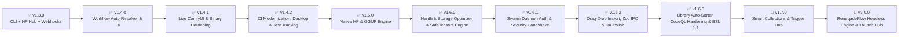

# Renegade Core Model Manager — Product Roadmap

This document outlines the milestones, completed capabilities, upcoming architectural evolutions, and development roadmap for **Renegade Core Model Manager (RenegadeCMM)**.

---

## Milestone Overview

```mermaid
graph LR
    v13["✅ v1.3.0<br/>CLI + HF Hub + Webhooks"] --> v14["✅ v1.4.0<br/>Workflow Auto-Resolver & UI"]
    v14 --> v141["✅ v1.4.1<br/>Live ComfyUI & Binary Hardening"]
    v141 --> v142["✅ v1.4.2<br/>CI Modernization, Desktop & Test Tracking"]
    v142 --> v15["✅ v1.5.0<br/>Native HF & GGUF Engine"]
    v15 --> v16["✅ v1.6.0<br/>Hardlink Storage Optimizer & SafeTensors Engine"]
    v16 --> v161["✅ v1.6.1<br/>Swarm Daemon Auth & Security Handshake"]
    v161 --> v162["✅ v1.6.2<br/>Drag-Drop Import, Zod IPC & UX Polish"]
    v162 --> v163["✅ v1.6.3<br/>Library Auto-Sorter, CodeQL Hardening & BSL 1.1"]
    v163 --> v17["🎯 v1.7.0<br/>Smart Collections & Trigger Hub"]
    v17 --> v20["🎯 v2.0.0<br/>RenegadeFlow Headless Engine & Launch Hub"]
```

---

## Completed Milestones

### Phase 1: v1.4.0 — Workflow Auto-Resolver & Local API Custom Node Bridge

> **Goal**: Turn the Workflow Scanner engine into an interactive visual tab with automatic missing model resolution, and provide a secure Local API bridge for external ComfyUI custom nodes.

- [x] **Dedicated "Workflows" UI Tab**:
  - Drag-and-drop ComfyUI `.json` workflows or generated `.png` images with dual `tEXt`/`iTXt` chunk parsing.
  - Spatial Visual Node Map with zoom/pan and node readiness color codes.
  - Dependency matrix identifying installed vs. missing Checkpoints, LoRAs, VAEs, ControlNets, UNETs, and Upscalers.
- [x] **One-Click Missing Model Resolution**:
  - Download missing model dependencies directly from workflow cards.
- [x] **Localhost API Bridge & Custom Node Companion**:
  - Local HTTP REST bridge on port `5174` with strict loopback binding (`127.0.0.1`) and origin verification.
  - Companion custom node support ([`ComfyUI-Model-Manager`](https://github.com/DevNullInc/ComfyUI-Model-Manager)).
- [x] **4-Tier Custom Node Resolver**:
  - Local check -> SQLite ETag registry cache -> GitHub Search API fallback -> one-click repository clone and dependency installation.

---

### Phase 1.1: v1.4.1 — Live ComfyUI Workspace Wrapper & Canvas Injection

> **Goal**: Seamlessly bridge the Workflows tab into running ComfyUI instances with real-time health probing, one-click canvas graph pushing, cross-app auto-saving, and background generation keep-alive.

- [x] **Dynamic Live ComfyUI Workspace**:
  - Background health probing (`/system_stats` / `/prompt`) detecting active ComfyUI instances.
  - Live Canvas mode embedding ComfyUI directly in the CMM window.
  - Split View mode displaying ComfyUI side-by-side with missing node cards and model dependencies.
  - Fullscreen canvas with quick workflow selector and slide-out node drawer.
- [x] **Resident Tab Keep-Alive System**:
  - Uninterrupted background generation when navigating between CMM tabs (`backgroundThrottling: false`).
  - Unified resident `<webview>` preventing canvas reloads.
- [x] **One-Click Workflow Canvas Injection**:
  - "Push to Canvas" injection into active ComfyUI instances via `window.app.loadGraphData(graph, true)`.
  - Automatic persistence saving uploaded `.json` and embedded `.png` workflows to ComfyUI's user workflow directory.
- [x] **Security & Elevation Hardening**:
  - Stripped NSIS `elevate.exe` (`packElevateHelper: false`, `allowElevation: false`, `perMachine: false`) to permanently resolve false-positive AV flags.

---

### Phase 1.2: v1.4.2 — CI/CD Modernization, Linux Desktop & Test Tracking

> **Goal**: Upgrade continuous integration runners to Node.js 22+ LTS, track unit tests in source control, and configure Linux desktop window associations.

- [x] **Automated Test Suite in Version Control**:
  - Complete unit and integration test suite tracked in `tests/` with 100% pass rate.
- [x] **Linux Desktop Window Association**:
  - Configured `desktopName: "renegadecmm.desktop"` and `syncDesktopName: true` for proper window grouping across GNOME, KDE, and Wayland.
- [x] **GitHub Actions Runner Upgrade**:
  - Configured `FORCE_JAVASCRIPT_ACTIONS_TO_NODE24: true` across all workflow runners.

---

### Phase 2: v1.5.0 — Native Hugging Face & GGUF Download Engine

> **Goal**: Equal-citizen support for Hugging Face `.safetensors`, GGUF quantizations, and next-generation model architectures.

- [x] **Native Hugging Face Download Pipeline**:
  - High-performance chunked downloads with Bearer token authentication for gated models (FLUX.1, SD3.5, Wan2.1, HunyuanVideo).
  - AWS S3 LFS redirect credential-stripping to prevent HTTP 400 Bad Request errors.
- [x] **Zero-Memory GGUF Header Parser**:
  - Little-endian binary parser (`ggufParser.ts`) reading 128KB header buffers for architecture and quantization tags (`Q4_K_M`, `Q8_0`, `BF16`).
  - Smart folder routing to `models/unet`, `models/LLM`, `models/text_encoders`, or `models/gguf`.
- [x] **Unified Dual-Source Search**:
  - Segmented toggle in Browse tab seamlessly querying CivitAI and Hugging Face Hub repositories.
  - Interactive Hugging Face repository file inspector with direct one-click downloading.
- [x] **Triple-Asset Companion File Generation**:
  - Automatically writes `<model>.sha256`, `<model>.<ext>` preview image, and `<model>.<host>.info` metadata JSON alongside weights.

---

### Phase 3: v1.6.0 — Storage Optimizer, SafeTensors Converter & RenegadeSwarm Integration

> **Goal**: Reclaim storage across multiple ComfyUI installations, eliminate legacy pickle security risks, and integrate with the RenegadeSwarm P2P ecosystem.

- [x] **NTFS / ext4 Hardlink Storage Optimizer (`storageOptimizer.ts`)**:
  - Groups duplicate models by SHA-256 hash.
  - Verifies drive volume boundaries and consolidates duplicate files into atomic hardlinks (`fs.linkSync`), reclaiming disk space while maintaining multiple ComfyUI folder structures.
- [x] **PyTorch Pickle-to-SafeTensors Converter (`modelConverter.ts` & `scripts/convert_to_safetensors.py`)**:
  - Converts legacy `.ckpt`, `.pt`, and `.bin` weights into `.safetensors` format with zero-copy binary serialization.
  - Multi-tier Python runtime and `.venv` probing.
  - Automated startup scripts ([`cmm.ps1`](../cmm.ps1), [`cmm.sh`](../cmm.sh), [`cmm-mac.sh`](../cmm-mac.sh)) with `install` / `setup` commands and automatic `.venv` provisioning.
- [x] **Hardware Capacity & OOM Assessment (`hardwareScanner.ts`)**:
  - Probes CPU cores, available system RAM, and GPU VRAM via NVIDIA NVML / `nvidia-smi` to prevent out-of-memory crashes during large model conversions.
- [x] **Model Precision Inspector (`precisionInspector.ts`)**:
  - Analyzes tensor datatypes to detect unneeded FP32 optimizer weights and inspects quantization levels (GGUF, EXL2, AWQ, INT8, INT4, NF4).
- [x] **Orphan & Unused Model Finder (`orphanFinder.ts`)**:
  - Cross-references ComfyUI workflows with installed library models to identify unused checkpoints and LoRAs.
- [x] **React Flow Interactive Node DAG (`@xyflow/react`)**:
  - Modernized visual workflow map with hardware-accelerated pan/zoom, crisp node cards, MiniMap, and zero rollup eval warnings.
- [x] **RenegadeSwarm Sister Application Integration (`swarmBridge.ts`)**:
  - Automatic focus, launch, and health monitoring of the native **RenegadeSwarm** Electron desktop window (daemon port 5180).
  - Automated decentralized ingestion notifications and single-model companion asset packager.

---

### Phase 3.1: v1.6.1 — RenegadeSwarm Daemon Bearer Auth Handshake, Sister Wakeup & Security Protocol

> **Goal**: Establish an authenticated, zero-trust inter-process communication bridge between RenegadeCMM and RenegadeSwarm with bidirectional wakeup signaling, 5-probe retry budgets, strict token hygiene, error diagnostics, and path confinement verification.

- [x] **Local Bearer Token Discovery & Management (`swarmAuthToken.ts`)**:
  - Main-process discovery of Swarm daemon token files (`daemon.token`) across Windows (`%APPDATA%\RenegadeSwarm`), macOS (`~/Library/Application Support/RenegadeSwarm`), Linux (`~/.config/RenegadeSwarm` and `~/.config/renegadeswarm`), and dev workspaces.
  - Strict 64-character hexadecimal format validation (`^[a-f0-9]{64}$`) with memory caching and automatic single-retry token reload on HTTP 401 Unauthorized responses.
- [x] **Bidirectional Sister Wakeup Protocol & Probe Rate-Limiting (`swarmBridge.ts`)**:
  - **Outbound Startup Poke**: Non-blocking `POST http://127.0.0.1:5180/api/sister/wakeup` on bridge launch with a 400ms timeout; failures swallowed cleanly when Swarm is offline.
  - **Inbound Sister Endpoint**: `POST /api/sister/wakeup` on port `5174` (loopback only, Bearer authenticated), resetting probe budgets to 5 and checking health immediately.
  - **5-Probe Retry Budget**: CMM caps offline health polling to 5 checks before sleeping, preventing infinite CPU/network background loops.
- [x] **Protected API Gateway Communication (`swarmBridge.ts`)**:
  - Transparently attaches `Authorization: Bearer <token>` and `X-Swarm-Auth-Token` to privileged Swarm endpoints (`POST /api/ingest`, `POST /api/models/scan`, `POST /api/window/focus`, `POST /api/sister/wakeup`).
  - Strict HTTP method enforcement (`POST` only for window focus; public access preserved for `/api/health`).
- [x] **Path Confinement Boundary Detection & Diagnostics**:
  - Surfaces HTTP 403 Forbidden responses specifically as *"Model path is outside Swarm's allowed folder roots (Path Confinement)"*.
  - Strict failure propagation returning `{ success: false }` when daemon focus, OS native window activation, and local executable launching all fail.
- [x] **Renderer Token Isolation & UI Security**:
  - Strict boundary isolation: secret token values are never exposed across IPC, rendered in UI components, or stored in persistent user settings.
  - Diagnostic banner in Settings tab surfacing active token presence, expected file system search paths with 1-click clipboard copy, and actionable auth failure warnings.

---

### Phase 3.2: v1.6.2 — Workflow Drag-and-Drop Import, Zod IPC Validation & UX Polish

> **Goal**: Secure end-to-end workflow file import pipeline with full-window drag-and-drop interception, harden all IPC channels with runtime Zod schema validation, expand the Live ComfyUI workspace for usable canvas sizing, and eliminate the blank startup window.

- [x] **End-to-End Workflow Drag-and-Drop Import Pipeline**:
  - Full-window drag-and-drop event interception with `dragDepthRef` and a fixed overlay (`z-[9999]`), reliably capturing drops anywhere in the application window including over embedded guest `<webview>` instances.
  - Pre-parsing magic byte verification rejecting disguised ELF, PE, and Mach-O binaries, with 50MB file size and 10MB JSON string caps.
  - PNG metadata extraction with explicit chunk precedence (`iTXt` > `tEXt` > `zTXt`).
  - Interactive `WorkflowImportModal` displaying detected node types, model reference breakdown, editable workflow title, and duplicate collision prompt.
  - Secure workflow archiving with regex name validation (`^[a-zA-Z0-9_\- ]+$`), directory confinement, case-insensitive collision detection, and atomic writes via nonce-prefixed temp files.
  - Automated post-import pipeline: immediate workflow activation, custom node resolution, Missing Nodes badge updates, and live ComfyUI canvas push.
- [x] **Zod IPC Schema Validation Migration**:
  - Replaced ad-hoc argument checks across all privileged main-process IPC handlers with strict runtime Zod schema validation.
  - Validated channels: `search-models`, `get-model`, `get-model-version`, `delete-local-model`, `test-webhook`, `clone-custom-node`, `resolve-missing-node`, `mark-node-installed`, `hf-check-model`, `hf-search-models`, `inspect-gguf`, `execute-hardlink-optimizer`, `package-companion-files`, `inspect-model-precision`, `convert-model-to-safetensors`, `assess-conversion-safety`, `ignore-model-update`, `unignore-model-update`, `ignore-duplicate-set`, `unignore-duplicate-set`, `set-model-nsfw`, and `open-external`.
  - Any payload violating schema contracts is rejected at the process boundary before execution.
- [x] **Live ComfyUI Expansive Workspace Layout**:
  - Expanded inline Live ComfyUI container to `min-h-[720px] h-[82vh]` with global CSS overrides enforcing `display: flex !important` and `flex: 1` on `webview` and `iframe` elements to prevent Chromium flex collapse.
  - Compacted top control bar in live mode to maximize canvas area.
  - Smooth-scroll navigation when activating Live ComfyUI mode.
  - Maximized viewport isolation: ComfyUI portal renders between the fixed header and footer with `<Minimize2 />` button and `Escape` hotkey exit.
- [x] **Application Startup Loading Throbber**:
  - Self-contained CSS and SVG animation embedded in `index.html` with concentric spinning rings, radial violet glow, floating RenegadeCMM emblem, gradient typography, shimmer progress bar, and status indicator.
  - Eliminates the blank window state during initial bundle parsing (5-10 second cold start).
- [x] **Automated Test Coverage**:
  - 12 dedicated drag-and-drop import tests covering magic byte validation, binary rejection, path traversal, prototype pollution, and atomic saves.
  - 139 total tests passing across the full suite.

---

### Phase 3.3: v1.6.3 — Library Auto-Sorter, CodeQL Zero-Vulnerability Sweep & BSL 1.1 Licensing

> **Goal**: Intelligent multi-architecture directory routing and automatic library sorting for modern DiT diffusion models, LLMs, and ComfyUI weights, comprehensive CodeQL static analysis remediation, zero-vulnerability supply chain hardening, and transition to the Business Source License 1.1 (BUSL-1.1).

- [x] **Business Source License 1.1 (BUSL-1.1) Transition**:
  - Full codebase transition to BSL 1.1 with single-user evaluation and commercial organizational tier (> 5 persons). Automatically converts to GNU General Public License v3.0 or later (GPL-3.0-or-later) after 4 years.
  - Standardized legal notices in [`LICENSE`](../LICENSE), [`LEGAL.md`](../LEGAL.md), [`SECURITY.md`](../SECURITY.md), [`README.md`](../README.md), and source code headers.
  - Built-in Ed25519 identity keypair generation, license signature verification (`licenseService.ts`), and offline registration validation.
- [x] **Intelligent Library Auto-Sorter (`librarySorter.ts` & `LibraryTab.tsx`)**:
  - Automated inspection of scanned ComfyUI libraries to identify misplaced models (ControlNets misfiled in `checkpoints/`, standalone Anima/Wan/Flux DiT diffusion models, Qwen/Quan LLMs, LoRAs, VAEs, and Upscalers).
  - Moves companion file triplets (`.preview.*`, `.info`, `.sha256`, `.json`, `.yaml`) atomically alongside model weights.
  - Safe collision handling with size-matching deduplication and timestamp suffixes.
  - Interactive sorting modal with selection controls and real-time relocation progress indicators.
- [x] **Intelligent Multi-Architecture Folder Routing (`folderRouter.ts` & `app.ts`)**:
  - **Modern DiT & Diffusion Models**: Anima, Krea (Flux.1 Krea), Wan Video (Wan 2.1), CogVideoX, Hunyuan Video, Mochi, LTXV, AuraFlow, Lumina, Chroma, and PixArt automatically route to `models/diffusion_models/` (or `models/unet/`).
  - **Language & Multimodal LLMs**: Quan, Qwen, Qwen 2.5, Llama, Mistral, Gemma, DeepSeek, and Phi weights route to `models/LLM/` (or `models/gguf/` if quantized).
  - **Specialized Adapter Preservation**: LoRAs, LoCons, DoRAs, ControlNets, VAEs, and Textual Inversions targeting Anima, Qwen, or Krea safely preserve their dedicated destination folders (`loras/`, `controlnet/`, `vae/`, `embeddings/`) without being diverted into base model directories.
  - **Standard Directory Scaffolding**: Added `LLM` to `COMFYUI_STANDARD_MODEL_SUBFOLDERS` for directory scaffolding across target roots.
- [x] **Browse Tab Quick Actions & Architecture Disambiguation (`BrowseTab.tsx` & `modelUtils.ts`)**:
  - Direct numerical model ID search queries (`/models/{id}`) for numeric inputs.
  - Quick Download and Quick Update buttons with strict base model architecture matching (preventing Anima vs Illustrious/SDXL version clashes).
- [x] **CodeQL & Supply Chain Zero-Vulnerability Sweep**:
  - Remediated all 63 CodeQL alerts on GitHub: eliminated TOCTOU filesystem race conditions via atomic flags (`wx`, `COPYFILE_EXCL`), sanitized child process execution in model conversion, broke outbound network taint chains with strict regex sanitizers, and pinned GitHub Actions to immutable commit SHAs.
  - Upgraded dependencies via overrides/resolutions: `fast-uri` (`3.1.8`), `axios` (`1.20.0`), `undici` (`7.30.0`), `brace-expansion` (`2.1.7`), `http-cache-semantics` (`4.3.0`).
  - 100% test coverage: **186 unit/integration tests passing across 28 suites**.
- [x] **Remote Desktop Graphics Mode (`cmm.ps1`, `cmm.bat`, `src/main/index.ts`)**:
  - Added `Start-Remote` and `Restart-Remote` commands disabling GPU hardware acceleration to eliminate modal window flickering and compositor artifacts during remote desktop (RDP/VNC) sessions.
- [ ] **Pickle-to-SafeTensors Converter Architecture Overhaul (`scripts/convert_to_safetensors.py` & `modelConverter.ts`)**:
  - **Problem Analysis**: The current Python conversion routine (`convert_to_safetensors.py`) applies state-dict unpacking heuristics designed primarily for monolithic Stable Diffusion checkpoints and LoRAs (searching specifically for `state_dict`, `model`, or `module` wrapper keys). When processing non-checkpoint pickle containers (such as standalone DiT transformer weights, text encoders, VAEs, custom pickled model packages, or standalone modules), the script misidentifies the internal tensor hierarchy or erroneously assumes the model is a LoRA/checkpoint, resulting in missing weight keys or conversion failures.
  - **Planned Architecture Fix**:
    - **Generic Dynamic Archive Introspection**: Refactor PyTorch deserialization to traverse arbitrary nested object graphs, collections, and custom Python class instances without hardcoded assumptions about checkpoint/LoRA dictionary keys.
    - **Modular Conversion Profiles**: Implement dedicated extraction profiles for:
      1. *Monolithic Checkpoints* (SD 1.5, SDXL, Pony).
      2. *LoRAs / LoCons / DoRAs* (preserving `lora_unet_*`, `lora_te_*` naming conventions).
      3. *Standalone DiT / UNet Weights* (Flux, Wan, Hunyuan, Anima, CogVideo).
      4. *Text Encoders & CLIP / T5 Modules*.
      5. *VAEs & Autoencoders*.
      6. *Raw PyTorch State-Dicts & Arbitrary Tensors*.
    - **Tensor Metadata & Header Preservation**: Retain tensor dtype fidelity (FP16, BF16, FP32) and write appropriate SafeTensors header metadata tags (`__metadata__`) without corrupting non-LoRA layer weights.
    - **Safe Memory Streaming**: Implement chunked streaming conversion for large models (> 10GB) to prevent host memory exhaustion during CPU state-dict deserialization.

## Planned Future Releases

### Phase 4: v1.7.0 — Smart Collections, Trigger Word Hub & Semantic Search

> **Goal**: Complete creative workstation and prompt curation engine.

- [ ] **LoRA Trigger Word & Prompt Injector**:
  - One-click copy and direct ComfyUI node injection of trained trigger words and recommended LoRA strength weights.
- [ ] **Custom Collections & Smart Playlists**:
  - Group models by project, art style, or architecture (e.g. *"Flux Realism Setup"*, *"SDXL Inpainting Kit"*, *"Anime Style LoRAs"*).
- [ ] **Local Semantic Search**:
  - Embed local model descriptions and prompt tags with a lightweight embedded vector index for natural language queries (e.g. *"find cinematic warm lighting LoRAs"*).

---

### Phase 5: v2.0.0 — RenegadeFlow Native Headless Engine & Modular AI Workstation

> **Goal**: Expand RenegadeCMM into an integrated generative AI workstation powered by the native RenegadeFlow inference engine, local multi-modal package orchestration, and isolated runtime environments.

- [ ] **RenegadeFlow — Native Headless Inference Engine**:
  - High-performance, lightweight headless execution backend integrated directly into the Workflows tab, replacing external bloated third-party node-graph software runtimes and standalone browser wrappers.
  - Complete backwards compatibility with existing third-party node extensions, custom nodes, and serialized JSON/PNG workflow graphs, enabling existing setups to transition without modification.
  - Native execution pipeline with optimized memory buffers, direct GPU scheduling, background prompt queuing, and real-time generation preview streaming directly within RenegadeCMM.
- [ ] **Automated Host Package Installer & Environment Provisioning**:
  - One-click native installation and environment setup for supported generation suites directly onto the host computer.
  - Automated dependency bootstrapping: Git cloning, isolated Python virtual environments (`.venv`), PyTorch/CUDA wheels, and required dependencies.
  - Built-in one-click package updater, dependency health repair, and version rollback management.
- [ ] **Integrated Local LLM & Multi-Modal Packages**:
  - Package orchestration for local LLM runtimes (Ollama, llama.cpp, text-generation-webui, KoboldCPP).
  - Cross-modal workflow bridging allowing local LLMs to generate prompts, detailed captions, and structured generation parameters directly for diffusion engines.

  ### Phase X: vX.X.X TBD
- [ ] **Universal Multi-Gen Launchpad & Suite Selector**:
  - Unified launchpad allowing users to configure and boot external third-party generation environments with dedicated package profile switching, customizable launch flags, port overrides, environment variables, and GPU acceleration arguments.
  - Cross-engine unified model linker to eliminate duplicate model files across engines using automated symlinks, hardlinks, or NTFS junctions.
  - Centralized master model repository management with hot-swap link relocation.

---

## Documentation Index

- [Feature Reference Guide](FEATURES.md)
- [Architecture & Process Isolation](ARCHITECTURE.md)
- [Local REST API Reference](API_REFERENCE.md)
- [API Security & Boundary Protections](APISecurity.md)
- [Legal Notices & Third-Party Licenses](../LEGAL.md)
- [Security Policy & Disclosures](../SECURITY.md)
- [Privacy Policy](../PRIVACY.md)
- [Contributing Guidelines](../CONTRIBUTING.md)
